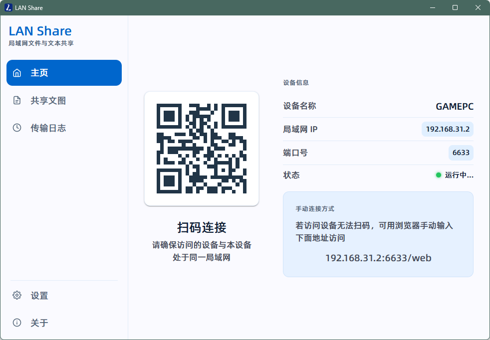

[English](../../README.md) | **中文**

---

# Lan Share

> 局域网内的文件、文字和图片共享工具，支持 Windows、macOS 和 Linux。电脑运行后，与电脑互通（同一局域网）的任何设备，用现代浏览器就能查看和下载共享的内容。

## 工作原理

Lan Share 会在你电脑上启动一个小型文件服务器。连上同一个 Wi-Fi 的手机、平板、笔记本甚至电视，都能打开浏览器看你共享的内容。数据只在局域网里走，不会传到外网。

## 快速上手

1. **下载安装** — 从 [Releases](https://github.com/SomunsMo/lan-share/releases) 下载对应系统的安装包
2. **安装并打开** Lan Share
3. **选一个要共享的文件夹**（在设置页面操作）
4. **用手机扫首页的二维码**，或者在浏览器里输入主页上显示的地址（比如 `http://192.168.x.x:6633`）

搞定了，直接用。

## 功能一览

### 文件共享
- 共享文件夹里的文件，任何设备都能浏览和下载
- 从浏览器上传文件，整个文件夹也行
- 支持重命名和删除（可选，在设置里开启）
- 支持拖拽上传

### 文字和图片共享
- 电脑上打一段字，其他设备马上就能看到
- 剪贴板里的图片可以直接分享，不用先存到本地
- 桌面端和 Web 端都能查看分享历史

### 实时同步
- 任何设备上传、重命名、删除文件或分享文字、图片，Web 页面都会自动刷新，不用手动刷新
- 文件列表随操作实时更新；共享根目录变更后，浏览器自动回到新的根目录
- 权限设置在改动后立即同步到所有打开的浏览器
- 实时连接断开时，页面顶部会出现带重连倒计时的提示条，也可以随时手动重连

### 传输记录
- 所有文件、文字、图片的分享记录都保留着
- 按类型（文字/文件/图片）筛选、按内容搜索、按时间排序
- 复制和下载事件也会被记录下来

### 个性化设置
- **浅色/深色主题**——桌面端和 Web 端可以分开设置
- **强调色**——用 HSL 调色板随便选个喜欢的颜色
- **端口**——HTTP 端口可以自由修改（默认 6633）

### 国际化
- **中文和英文**——可以在设置里随时切换，也会自动检测你的系统语言
- 桌面端和 Web 端都完整支持双语

### 安全可控
- 共享文件夹之外的文件访问不到
- 上传、重命名、删除、覆盖这些操作**默认全关**，由你自己决定开哪些
- 删除的文件可以进回收站（可选）
- 危险文件名和路径穿越攻击自动拦截
- 内置和自定义的文件排除规则

### 跨平台
- **Windows、macOS、Linux**——桌面端在这三个系统上都能运行，体验一致
- 支持系统托盘，随时打开
- 可选开机自启，开机后直接最小化到托盘

## 常见问题

| 问题 | 回答 |
|------|------|
| 需要联网吗 | 不需要。只走局域网，没网也能用 |
| 哪些设备能访问 | 任何带浏览器的设备都行——手机、平板、笔记本、智能电视。不用装 App |
| 数据安全吗 | 数据不会离开你的局域网，外网连不进来 |
| 能同时共享多个文件夹吗 | 目前一次只能共享一个，但随时可以在设置里换 |
| 在哪反馈问题 | 在 [GitHub](https://github.com/SomunsMo/lan-share/issues) 上提 Issue 就行 |

## 给开发者

技术架构、API 文档、构建指南和参与贡献的方式，请见[开发指南](development.md)。

## 许可

MIT
